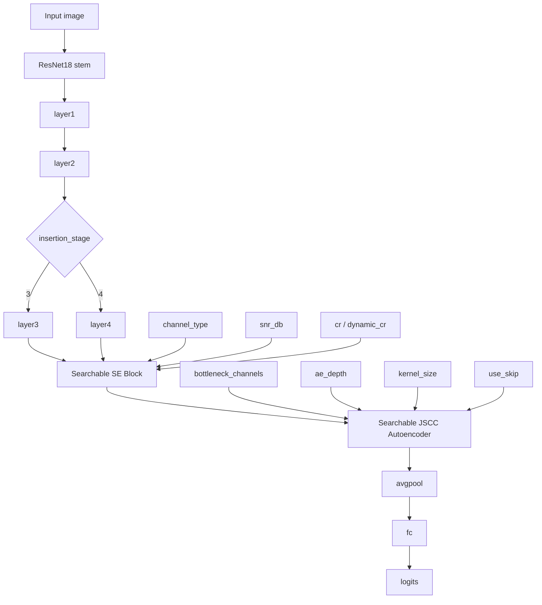
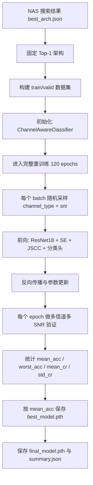
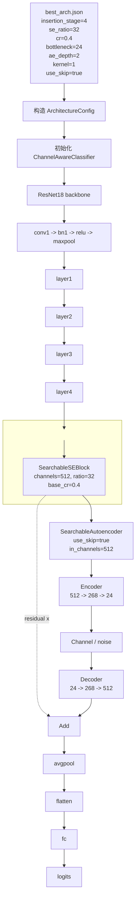
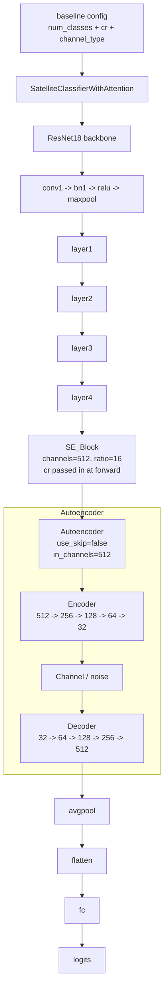
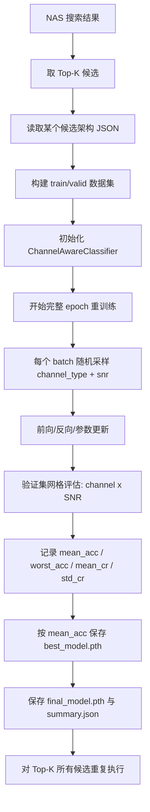
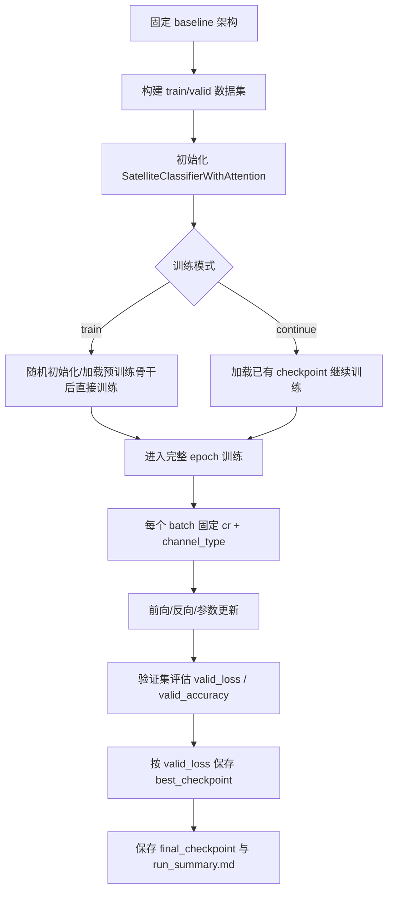

# NAS Top-K 重训练与原结构完整训练逻辑对照

本文档用于说明两条训练路线：

1. NAS 搜索得到的 top-k 架构如何重训练。
2. 原始 baseline 结构如何完整训练。
3. 两者在训练目标、流程、输出和对比方式上的区别。

## 先给结论

- NAS top-k 重训练的核心是“**先搜索结构，再把选中的候选从头训练到完整收敛**”。
- 原结构完整训练的核心是“**固定 baseline 架构，直接做标准训练或断点续训**”。
- 两者最后都要进入统一 benchmark，才能公平比较。

## 1. NAS Top-K 重训练逻辑

这里的 top-k 指 NAS 搜索结果中的前 k 个候选架构。它们不是一起训练，而是**逐个独立重训练**。

### 1.1 输入与前提

| 项目 | 说明 |
| --- | --- |
| 输入架构 | `runs/nas_search/<run_id>/best_arch.json` 或 `topk_arches.json` 中的候选 |
| 数据集 | 例如 `UCMerced_LandUse` |
| 数据划分 | 固定的 `train / valid` 目录 |
| 模型 | `ChannelAwareClassifier` |
| 训练目标 | 让某个候选架构在完整训练轮数下重新收敛 |

### 1.2 当前实际执行的 Top-1 流程

当前项目里已经完成的重训练对象是 **Top-1 架构**，也就是 NAS 搜索结果中 rank-1 的候选。

对应到实际运行，流程是：

1. 从 NAS 搜索结果中读取 `best_arch.json`。
2. 将这个架构固定下来，作为本次重训练的唯一对象。
3. 构建与 baseline 一致的 `train / valid` 数据划分。
4. 以 `ChannelAwareClassifier` 初始化模型。
5. 使用完整训练轮数进行重训练，而不是搜索阶段的短代理训练。
6. 每个 batch 随机采样 `channel_type + snr`，增强多信道泛化。
7. 每个 epoch 在 `AWGN / Fading / Combined_channel` 和多个 SNR 网格上验证。
8. 按验证集 `mean_acc` 保存 `best_model.pth`。
9. 保存 `final_model.pth`、`summary.json`、`tensorboard/`。

如果要向导师举例，可以直接用这次实际跑过的 Top-1：

- 搜索结果来源：`runs/nas_search/UCMerced_LandUse_20260305_215121/best_arch.json`
- 重训练输出目录：`runs/nas_retrain/UCMerced_LandUse_20260305_224907`

### 1.2.1 ChannelAwareClassifier 前向流程图



这张图里，`ChannelAwareClassifier` 的核心就是：

- `insertion_stage` 决定从 `layer3` 还是 `layer4` 开始接入 NAS 块
- `channel_type + snr_db` 影响 `Searchable SE Block` 的通道选择
- `cr / dynamic_cr` 决定 top-k 保留多少通道
- `bottleneck_channels / ae_depth / kernel_size / use_skip` 决定 JSCC 自编码器怎么压缩、怎么重建

#### 1.2.1.1 这条流程具体在做什么

这段不是“简单做一次 SE”，而是把**当前特征内容**和**当前信道状态**一起送进一个条件化门控器，最后生成每个样本自己的通道保留掩码。

可以按 4 步理解：

1. 先从当前特征图做 `GAP`，得到 `semantic_vec`
   - 输入是 `x: [B, C, H, W]`
   - 输出是 `semantic_vec: [B, C]`
   - 这表示“这张图当前更像什么语义特征”

2. 再把 `channel_type + snr_db` 编码成 `cond_vec`
   - `channel_type` 先变成离散 embedding
   - `snr_db` 会先按 `28` 做归一化，再进小 MLP
   - 两路向量拼接后得到 `cond_vec: [B, 32]`
   - 这表示“当前信道环境是什么”

3. `ChannelConditionedSelector` 负责算每个通道的权重 `weights`
   - 它把 `semantic_vec` 和 `cond_vec` 都投影到同一个 hidden 维度
   - 两路相加后过 `ReLU + Sigmoid`
   - 最终输出 `weights: [B, C]`，每个值都在 `0~1`
   - 这里不是固定 SE，而是“看语义 + 看信道”的条件化 SE

4. `RateController` 再预测每个样本自己的 `cr_i`
   - 输入仍然是 `semantic_vec + cond_vec`
   - 先得到一个 `raw` 值，再映射到 `[min_dynamic_cr, max_dynamic_cr]`
   - 然后和 `base_cr` 做线性融合：`blended = (1-alpha) * base_cr + alpha * dynamic_cr`
   - 所以这里的 `cr_i` 不是硬编码常数，而是**样本级动态保留比例**

最后一步是 `top-k mask by per-sample cr_i`：

- 对每个样本，根据 `cr_i * C` 算出要保留的通道数 `k_i`
- 在 `weights[i]` 里选 top-k 最大的通道
- 只保留这些通道，其余通道被置零
- 所以这一步的本质是：**按当前样本的重要性，保留不同数量的通道**

你可以把这条链路记成一句话：

> `semantic_vec` 决定“内容重要什么”，`cond_vec` 决定“信道环境适不适合”，`RateController` 决定“这一张样本到底保留多少通道”，最后 `top-k mask` 把结果真正落到特征图上。

#### 1.2.1.2 一个具体数字例子

下面用一个缩小版的例子把这条流程走一遍。真实模型里通道数是 `512`，这里先用 `8` 个通道来演示，逻辑是一样的。

假设输入特征图是：

```text
x: [1, 8, 4, 4]
```

### 第 1 步: GAP 得到语义向量

对 `x` 做全局平均池化后，得到：

```text
semantic_vec = [0.90, 0.10, 0.82, 0.05, 0.70, 0.18, 0.88, 0.12]
```

可以理解为：

- 第 1、3、5、7 个通道承载的信息更有用
- 第 2、4、6、8 个通道相对没那么重要

### 第 2 步: 编码信道条件

假设当前信道条件是：

```text
channel_type = AWGN
snr_db = 20
```

经过 `ChannelConditionEncoder` 后，得到一个条件向量 `cond_vec: [1, 32]`。  
它不是人工规则，而是把“信道类型 + 信噪比”映射成一个可学习表示。

### 第 3 步: 条件化选择通道权重

`ChannelConditionedSelector` 会把 `semantic_vec` 和 `cond_vec` 融合，给 8 个通道打分，例如：

```text
weights = [0.91, 0.83, 0.10, 0.67, 0.58, 0.12, 0.95, 0.35]
```

这表示：

- 第 7 个通道最重要
- 第 1、2、4、5 个通道也比较重要
- 第 3、6 个通道比较不重要

### 第 4 步: RateController 预测本样本的保留比例

假设：

- `base_cr = 0.4`
- `dynamic_cr = 0.75`
- `blend_alpha = 0.7`

那么最终的样本级保留比例是：

```text
cr_i = (1 - 0.7) * 0.4 + 0.7 * 0.75
     = 0.12 + 0.525
     = 0.645
```

如果通道数 `C = 8`，那么：

```text
k_i = round(0.645 * 8) = 5
```

也就是说，这个样本最终保留 5 个通道。

### 第 5 步: top-k mask 真正落到特征图上

根据 `weights`，保留最大的 5 个通道，例如：

- 通道 7
- 通道 1
- 通道 0
- 通道 3
- 通道 4

其余通道直接置零。  
于是原来的 8 通道特征图，就变成了“只保留最重要的 5 个通道”的版本。

### 第 6 步: 送入后续 JSCC

筛过的特征再进入 JSCC 编码器。  
在 Top-1 模型里，如果 `use_skip=true`，JSCC 输出还会和输入残差相加；如果是原模型，则没有这条残差旁路。

### 这个例子可以怎么讲

你可以直接用一句话概括：

> 这条流程不是固定剪通道，而是先看“内容重要什么”、再看“信道环境怎么样”，最后对每个样本单独决定保留多少通道、保留哪些通道。

### 1.2.2 Top-1 实际流程图



### 1.2.3 Top-1 实例化后的模型结构图



这张图对应的是 Top-1 最终真正实例化出来的网络形状，而不是搜索空间里的抽象候选：

- `insertion_stage=4`，所以 NAS 模块插在 `layer4` 后面
- `feature_channels=512`，因此 SE 和 JSCC 都以 `512` 通道特征为输入
- `se_ratio=32`，表示 SE 的 squeeze 隐藏层是 `512 / 32 = 16`
- `cr=0.4`，表示 top-k 初始保留比例是 `40%`
- `bottleneck_channels=24`、`ae_depth=2`、`kernel_size=1`，决定 JSCC 的具体编码器/解码器形状
- `use_skip=true` 表示实例化后的 JSCC 模块带残差旁路，最终输出是 `decoder_output + residual x`，其中 `x` 是进入 JSCC 前的那份特征图

### 1.2.4 原模型实例化后的模型结构图



这张图对应的是原模型的实例化结构，和 Top-1 结构相比，差异主要有三点：

- 没有 `insertion_stage`，因为原模型始终是在 `layer4` 后接入 `SE + Autoencoder`
- `SE_Block` 的 `ratio` 是固定默认值 `16`，而不是 NAS 搜索得到的可变 `se_ratio`
- `Autoencoder` 没有 `skip` 分支，输出就是纯 decoder 结果，不会再和输入残差相加

另外，原模型里的 `cr` 不是写在架构配置里，而是训练/推理时通过 `forward(x, cr, channel_type)` 传进去，用来控制 `SE_Block` 的 hard top-k 掩码比例。

### 1.3 训练逻辑

- 先从 NAS 搜索结果中取 top-k 候选。
- 每个候选都单独启动一次重训练 run。
- 模型结构固定为该候选架构，不再重新搜索。
- 每个 batch 会随机采样 `channel_type + snr`。
- 训练时使用完整 epoch 数，而不是 search 阶段的短代理训练。
- 每个 epoch 在 `AWGN / Fading / Combined_channel` 和多个 SNR 上做网格验证。
- 以验证集 `mean_acc` 保存 `best_model.pth`。
- 同时保存 `final_model.pth` 和完整 `summary.json`。

### 1.4 流程图



### 1.5 输出

| 输出 | 作用 |
| --- | --- |
| `best_model.pth` | 按验证集 `mean_acc` 选出的最佳权重 |
| `final_model.pth` | 最后一轮训练结束时的权重 |
| `summary.json` | 每轮 loss / acc / cr 统计、分信道和分 SNR 结果 |
| `tensorboard/` | 训练曲线与验证曲线 |
| `arch.json` | 本次实际重训的架构副本 |

### 1.6 这个流程的重点

- NAS 搜索阶段只负责找结构，不负责最终收敛。
- 重训练阶段才是论文里真正要汇报的候选模型结果。
- Top-k 不是“k 个模型一起训练”，而是“k 个架构分别单独训练”。

## 2. 原结构完整训练逻辑

原结构指 baseline 模型，也就是固定的 ASE-JSCC 训练路线，脚本是 `scripts/train/ASE-JSCCtrain.py`。

### 2.1 输入与前提

| 项目 | 说明 |
| --- | --- |
| 输入结构 | 固定 baseline 架构 |
| 数据集 | 例如 `UCMerced_LandUse` |
| 数据划分 | 固定的 `train / valid` 目录 |
| 模型 | `SatelliteClassifierWithAttention` |
| 训练模式 | `train` 或 `continue` |

### 2.2 训练逻辑

- 结构固定，不做 NAS 搜索。
- 主干是 ResNet18 + SE Block + Autoencoder。
- `cr` 和 `channel_type` 在训练时是固定的。
- 每个 batch 都按固定 channel 配置做前向训练。
- `train` 模式是从头完整训练。
- `continue` 模式是加载已有 checkpoint 后继续训练。
- 每个 epoch 都在验证集上计算 `valid_loss` 和 `valid_accuracy`。
- 以 `valid_loss` 最低保存 `best_checkpoint`。
- 最后一轮保存 `final_checkpoint`。

### 2.3 流程图



### 2.4 输出

| 输出 | 作用 |
| --- | --- |
| `best_checkpoint` | 按验证损失最优保存的模型 |
| `final_checkpoint` | 最后一轮训练结束时的模型 |
| `run_summary.md` | 训练配置、时间、结果摘要 |
| `tensorboard/` | 训练日志 |
| `.txt` 日志 | 纯文本训练记录 |

### 2.5 这个流程的重点

- 原结构不涉及架构搜索。
- 训练目标是把 baseline 本身训练好。
- 选择最优模型时，依据通常是验证损失，而不是 NAS 的多目标分数。

## 3. 两者的核心区别

| 维度 | NAS Top-K 重训练 | 原结构完整训练 |
| --- | --- | --- |
| 目标 | 验证候选架构的最终性能 | 训练固定 baseline |
| 输入 | NAS 搜索得到的候选架构 | 预先定义好的原始结构 |
| 是否搜索 | 否，重训练阶段不再搜索 | 否 |
| 架构是否变化 | 每个 top-k 候选可能不同 | 固定不变 |
| 训练方式 | 每个候选独立从头训练 | 从头训练或断点续训 |
| 信道与 SNR | 训练与验证都更强调多信道、多 SNR 网格 | 通常是固定 `channel_type` + 固定 `cr` |
| 评价指标 | `mean_acc`、`worst_acc`、`mean_cr`、`std_cr`、`acc_map` | `valid_loss`、`valid_accuracy` |
| 最优权重保存 | 按 `mean_acc` 保存 `best_model.pth` | 按 `valid_loss` 保存 `best_checkpoint` |
| 最终用途 | NAS 论文里的候选结果 | baseline 对照组 |
| 对比方式 | 进入统一 benchmark 再和 baseline 比 | 进入统一 benchmark 再和 NAS 比 |

## 4. 为什么这两条路线不能直接混着比

- NAS top-k 重训练的模型是“结构搜索后得到的最佳候选”，而原结构是“人工固定 baseline”。
- NAS 重训练时会按多信道、多 SNR 做网格验证，信息量更丰富。
- 原结构训练更像标准 baseline 训练，训练逻辑和选择最优 checkpoint 的规则都不同。
- 如果不做统一 benchmark，直接拿训练日志里的数值比较，会有口径不一致的问题。

所以最终比较要统一到同一套协议：

- 同一数据集
- 同一验证集
- 同一预处理
- 同一信道类型
- 同一 SNR 采样范围
- 同一 Monte Carlo 重复次数

## 5. 适合向导师汇报的一段话

我们现在的实验流程分成两层。第一层是 NAS 搜索出来的 top-k 候选架构，我会把每个候选单独拿出来做完整重训练，让它在固定数据划分和多信道、多 SNR 条件下重新收敛，并记录 best/final checkpoint 以及完整验证统计。第二层是原始 baseline 结构，它不参与搜索，而是按固定结构直接完整训练，作为对照组。最后两者统一放到同一 benchmark 协议下比较，这样才能公平地比较精度、鲁棒性和传输代价。

## 6. 关联脚本

| 脚本 | 职责 |
| --- | --- |
| `scripts/nas/search_channel_aware.py` | 搜索候选架构 |
| `scripts/nas/retrain_candidate.py` | 重训练 NAS 候选 |
| `scripts/train/ASE-JSCCtrain.py` | 训练原始 baseline |
| `scripts/benchmark/compare_models.py` | 统一评测 NAS 与 baseline |

## 7. 相关文档

- [NAS 全量重训练指南](./NAS全量重训练指南.md)
- [原始模型训练指南](./原始模型训练指南.md)
- [模型对比评测指南](./模型基准测试指南.md)
- [NAS 实现总览](./NAS实现总览.md)

