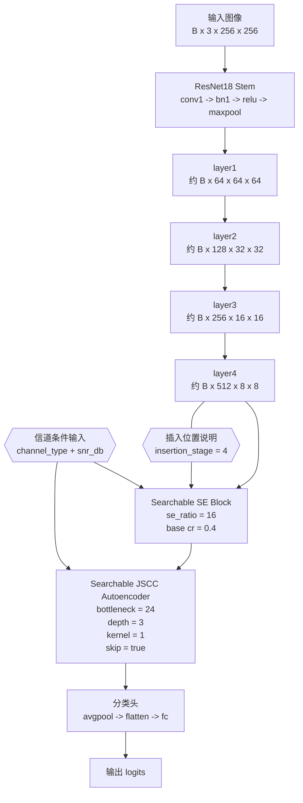
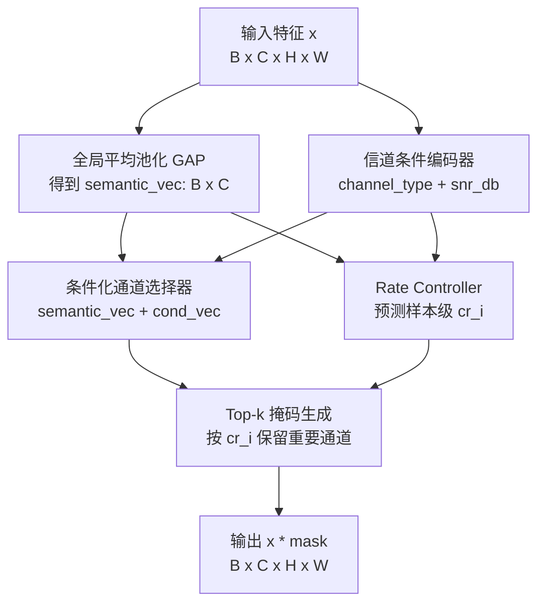
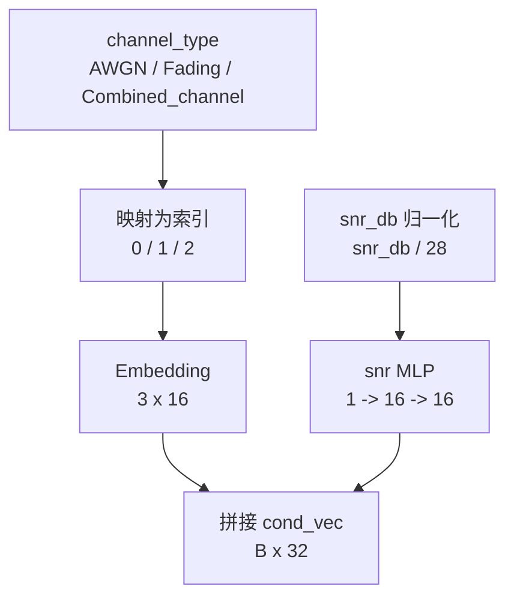
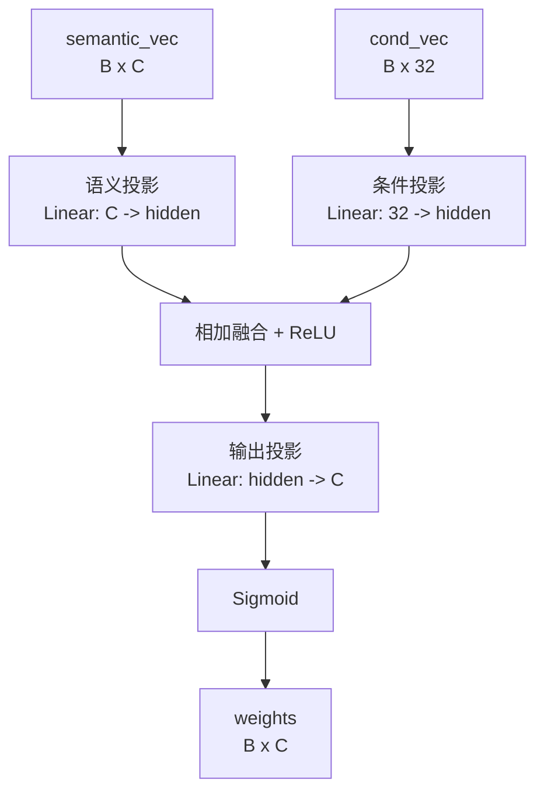
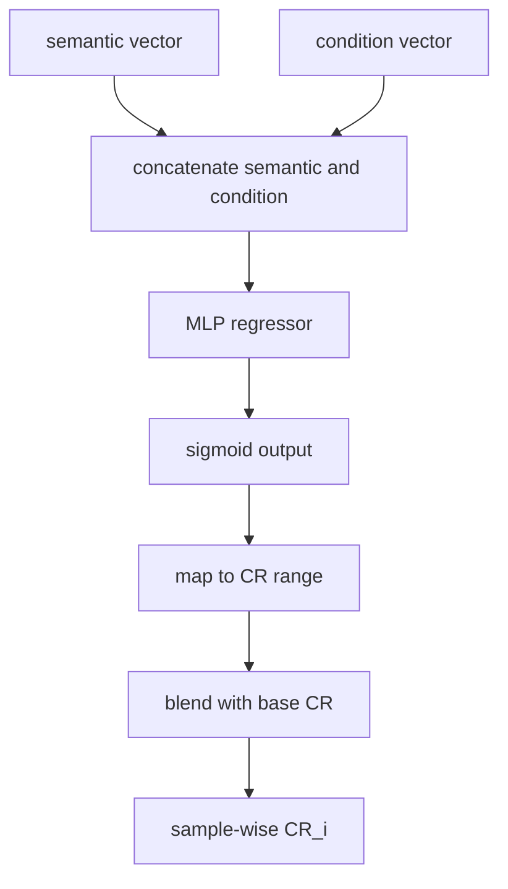
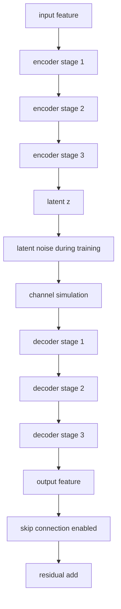

# NAS v2 Top-1 架构详细结构图

本文档用于说明当前 v2 exhaustive search 找到的 Top-1 架构到底长什么样，以及它在代码里是如何前向传播的。

对应的最优架构配置来自：

- [results/runs/nas_search_v2/exhaustive_search/UCMerced_LandUse_20260407_212521/best_arch.json](../results/runs/nas_search_v2/exhaustive_search/UCMerced_LandUse_20260407_212521/best_arch.json)

该架构的关键参数是：

- `insertion_stage = 4`
- `se_ratio = 16`
- `cr = 0.4`
- `bottleneck_channels = 24`
- `ae_depth = 3`
- `kernel_size = 1`
- `use_skip = true`

---

## 1. 总体结构图



### 读图方式

- `insertion_stage = 4` 表示 NAS 模块插在 `layer4` 之后。
- 也就是说 backbone 先完整提取高层语义特征，再交给 NAS 模块做通道筛选和 JSCC 传输模拟。
- 由于输入是 `256 x 256`，因此在 `layer4` 之后的特征图可以近似理解为 `B x 512 x 8 x 8`。

---

## 2. SE 模块内部结构

`SearchableSEBlock` 不是普通固定 SE，而是带有信道条件和动态码率的可搜索版本。

### 2.1 总体流程图



### 2.2 这部分在做什么

- `GAP` 把每个通道压成一个全局语义统计量。
- `channel_type` 和 `snr_db` 会先进入条件编码器，形成信道状态向量。
- 条件化选择器根据“语义 + 信道状态”给出每个通道的重要性权重。
- `RateController` 再根据语义和信道状态预测每个样本自己的 `cr_i`。
- 最后根据 `cr_i` 做 `top-k`，生成硬掩码，把不重要的通道直接置零。

### 2.3 条件编码器展开



- `channel_type` 是离散信道条件，先映射成索引再查表 embedding。
- `snr_db` 是连续信道条件，先归一化到大约 `[0,1]` 再送入两层 MLP。
- 两路结果拼接后得到 `cond_vec`，维度默认是 `32`。

### 2.4 条件化选择器展开



- `hidden = channels // ratio`，这里 `ratio = se_ratio = 16`。
- `semantic_vec` 与 `cond_vec` 先分别投影到同一隐藏维度。
- 两路结果相加后过 `ReLU`，再映射回通道维，最后 `Sigmoid` 得到通道权重。
- 这一步得到的是“每个通道有多重要”的软权重。

### 2.5 动态码率控制器展开



- 这一路输出的是样本级 `cr_i`，不是固定常数。
- `base_cr = 0.4` 是架构先验。
- `blend_alpha` 控制动态预测和固定先验的融合强度。
- 当前 top1 中，这一步会让不同样本在同一个架构下使用略微不同的保留比例。

### 2.6 Top-k 掩码

- `weights` 和 `cr_i` 一起进入 `top-k` 掩码生成。
- 每个样本按 `cr_i * C` 计算保留通道数 `k`。
- `k` 个最大权重通道保留，其余通道置零。
- 这样就把“软权重”变成了“硬选择”。

### 2.7 当前 top1 对应参数

- `se_ratio = 16`
- `cr = 0.4`

这表示：

- 通道选择的隐藏维度较小，偏轻量。
- 基础压缩率也比较低，属于“先保守保留信息，再做细粒度筛选”的风格。

---

## 3. JSCC Autoencoder 内部结构

`SearchableAutoencoder` 是一个可搜索的传输模块，负责把特征编码、加噪、再解码回来。

### 3.1 总体流程图



### 3.2 这个模块的结构细节

- 编码器和解码器都是按 `depth` 构造的卷积序列。
- 当前 top1 的 `depth = 3`，因此会形成 3 段编码、3 段解码的结构。
- `bottleneck_channels = 24`，意味着特征会被压到一个很窄的 latent 空间。
- `kernel_size = 1`，表示主要做通道混合和压缩，不强调空间邻域建模。
- `use_skip = true`，表示如果输入输出尺寸一致，就把残差直接加回去，减少信息损失。

### 3.3 编码器展开

- `Encoder Stage 1`：把 512 通道先压到约 349 通道。
- `Encoder Stage 2`：继续压到约 187 通道。
- `Encoder Stage 3`：最终压到 24 通道 latent。
- 因为 `kernel_size = 1`，所以每一步更像是“通道投影 + 非线性”，而不是大范围空间卷积。

### 3.4 信道扰动展开

- 训练时会先在 latent 上额外加高斯噪声，增强鲁棒性。
- 然后根据 `channel_type` 进入三种信道仿真之一：
  - `AWGN`
  - `Fading`
  - `Combined_channel`
- 这一步是 JSCC 的核心，把“神经特征传输”显式变成“带信道扰动的 latent 传输”。

### 3.5 解码器展开

- `Decoder Stage 1`：24 -> 187
- `Decoder Stage 2`：187 -> 349
- `Decoder Stage 3`：349 -> 512
- 最后恢复到与输入相同的特征形状，方便后续和残差相加。

### 3.6 残差旁路

- 如果 `use_skip = true` 且张量 shape 完全一致，就执行 `out = out + residual`。
- 这条旁路能减轻压缩带来的信息损失，也让训练更稳定。

### 3.7 通道调度的理解

`depth = 3` 时，编码器通道会从输入通道逐步插值到瓶颈通道。

以 `B x 512 x 8 x 8` 为例，可以理解成大致经历：

```text
512 -> 349 -> 187 -> 24
```

解码器则反向恢复：

```text
24 -> 187 -> 349 -> 512
```

---

## 4. 从代码前向看整条路径

对应 `scripts/nas/searchable_model.py` 里的前向逻辑，当前 top1 的实际执行顺序是：

```text
Input
 -> conv1
 -> bn1
 -> relu
 -> maxpool
 -> layer1
 -> layer2
 -> layer3
 -> layer4
 -> SearchableSEBlock
 -> SearchableAutoencoder
 -> avgpool
 -> flatten
 -> fc
 -> logits
```

因为 `insertion_stage = 4`，所以：

- NAS 模块不是插在 `layer3` 后面
- 而是插在 `layer4` 后面
- 这也是当前 v2 搜索结果里最稳定的选择

---

## 5. 这张架构图怎么汇报

你向导师解释时可以这样说：

> 当前 v2 搜索得到的最优架构是在 ResNet18 的最后一层 `layer4` 之后插入一个可搜索的 SE + JSCC 模块。  
> 其中 SE 模块会结合信道类型和 SNR 做通道选择，并且支持样本级动态压缩率；JSCC 模块则用三层卷积自编码器把 512 通道特征压缩到 24 通道 latent，再经过信道仿真和解码恢复回来，同时开启残差跳连来保留信息。  
> 这类结构的特点是“后段接入、轻量压缩、带残差保护”，因此在精度、传输代价和鲁棒性之间取得了比较好的平衡。

---

## 6. 相关代码

- [scripts/nas/searchable_model.py](../scripts/nas/searchable_model.py)
- [docs/NAS实现总览.md](./NAS实现总览.md)
- [docs/NAS搜索结果字段说明.md](./NAS搜索结果字段说明.md)
- [results/runs/nas_search_v2/exhaustive_search/UCMerced_LandUse_20260407_212521/best_arch.json](../results/runs/nas_search_v2/exhaustive_search/UCMerced_LandUse_20260407_212521/best_arch.json)
