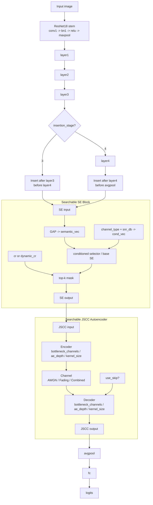
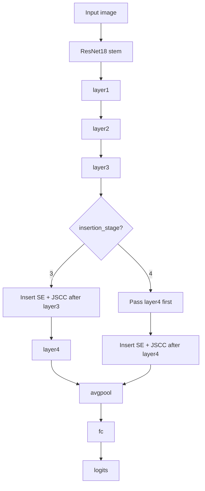

# NAS 7 个搜索维度对应原模型哪里动了

这份说明只回答一件事：**NAS 第一版搜索的 7 个维度，分别是在原始 ASE-JSCC 架构的哪一段动手脚。**

先记一个总原则：

- `insertion_stage` 决定 **JSCC 这一整块插在 ResNet 的哪一层后面**
- `se_ratio` 决定 **SE 这层“压缩到多窄”**
- `cr` 决定 **SE 里 top-k 最终保留多少通道**
- `bottleneck_channels` / `ae_depth` / `kernel_size` / `use_skip` 决定 **JSCC 自编码器怎么长**

## 1. 总图

下面这张图先看结构，再看每个维度标注。竖排版会比横排更适合论文式长图，也更适合你现在这种“每个模块都想看清”的场景。



## 2. 一句话定位每个维度

| 维度 | 动的是原模型哪里 | 原模型里是什么 | NAS 里变成什么 |
| --- | --- | --- | --- |
| `insertion_stage` | ResNet18 主干和 JSCC 的连接点 | 固定在 `layer4` 后 | 可选 `layer3` 后或 `layer4` 后 |
| `se_ratio` | SE 模块内部的 squeeze 压缩宽度 | 固定比例，原来常用 `16` | 可搜索 `4 / 8 / 16 / 32` |
| `cr` | SE 里最终保留多少通道 | 固定一个压缩率 | 可搜索 `0.4 / 0.6 / 0.8 / 1.0`，并可做动态样本级 CR |
| `bottleneck_channels` | JSCC 自编码器的瓶颈通道数 | 固定 latent 宽度 | 可搜索 `16 / 24 / 32 / 48 / 64` |
| `ae_depth` | JSCC 编码器和解码器的层数 | 固定深度 | 可搜索 `2 / 3 / 4` |
| `kernel_size` | JSCC 编码器和解码器卷积核大小 | 固定 `3x3` | 可搜索 `1 / 3 / 5` |
| `use_skip` | JSCC 输出端是否加残差旁路 | 原模型没有 | 可选 `False / True` |

## 3. 逐项展开

### 3.1 `insertion_stage`

这个维度改的是 **JSCC 插入位置**。

- `3` 表示：`... -> layer3 -> SE/JSCC -> layer4 -> avgpool -> fc`
- `4` 表示：`... -> layer4 -> SE/JSCC -> avgpool -> fc`

它不改变 ResNet18 的骨架，只是改变 **“在哪一层后面切开，插入 SE + JSCC”**。

下面这张图把它画成流程：



对应到代码里：

- `insertion_stage = 3` 时，`x` 先走到 `layer3`，再进 `SE -> JSCC`，然后继续过 `layer4`
- `insertion_stage = 4` 时，`x` 先完整过 `layer4`，再进 `SE -> JSCC`

你可以把它记成一句话：

- `3` = **更早插入**
- `4` = **更晚插入**

这也是为什么这个维度最像“插入点选择开关”，而不是改分类头或改输入本身。

### 3.2 `se_ratio`

这个维度改的是 **SE 模块里 MLP 的隐藏层宽度**。

在代码里可以理解成：

- 输入通道数为 `C`
- squeeze 后的隐藏层大约是 `C / se_ratio`

所以：

- `ratio` 越小，SE 越宽，表达能力更强，参数更多
- `ratio` 越大，SE 越窄，更省参数，但选择能力可能更弱

### 3.3 `cr`

这个维度改的是 **SE 选通道时最终保留多少通道**。

在原模型里，它更像一个固定超参，决定“保留多少比例的通道”。
在 NAS 版里，它变成了搜索维度，甚至可以根据 `channel_type + snr_db` 做样本级动态 CR。

直观理解：

- `cr = 1.0`：几乎不裁剪
- `cr = 0.4`：只保留大约 40% 的通道

### 3.4 `bottleneck_channels`

这个维度改的是 **JSCC 自编码器最窄那一层的通道数**。

它决定了中间表示“压得多狠”：

- 小一点：压缩更强，但信息损失更大
- 大一点：保真更好，但通信负担更高

### 3.5 `ae_depth`

这个维度改的是 **JSCC 编码器和解码器各自有几层卷积**。

它不是单改 encoder 或 decoder，而是整块 AE 的深度一起变。

- 深度小：结构轻，速度快
- 深度大：表达能力更强，但参数和计算也更多

### 3.6 `kernel_size`

这个维度改的是 **JSCC 内部每一层卷积的卷积核大小**。

NAS 里可搜索：

- `1x1`：更像通道投影，参数少
- `3x3`：最平衡
- `5x5`：感受野更大，但更重

### 3.7 `use_skip`

这个维度改的是 **JSCC 解码输出端是否加残差旁路**。

原模型是纯串联：

```text
out = Decoder(Channel(Encoder(x)))
```

NAS 版如果开 `skip`，会变成：

```text
out = Decoder(Channel(Encoder(x))) + x
```

前提是输入输出形状一致。

这个改动不动 backbone，也不动 SE，专门改 **JSCC 块的输出连接方式**。

## 4. 原模型 vs NAS，真正变的是哪几块

```mermaid
flowchart TB
    subgraph B[Original ASE-JSCC]
        direction TB
        B1[ResNet18 backbone] --> B2[Fixed insertion at layer4] --> B3[Fixed SE ratio] --> B4[Fixed CR] --> B5[Fixed JSCC depth / kernel] --> B6[No JSCC skip]
    end

    subgraph N[NAS Searchable Variant]
        direction TB
        N1[ResNet18 backbone] --> N2[insertion_stage in {3,4}] --> N3[se_ratio in {4,8,16,32}] --> N4[cr in {0.4,0.6,0.8,1.0}] --> N5[bottleneck_channels / ae_depth / kernel_size] --> N6[use_skip in {False,True}]
    end
```

## 5. 代码对照

如果你想回代码确认，对应位置是：

- `scripts/train/ASE-JSCCtrain.py`
- `scripts/nas/search_space.py`
- `scripts/nas/searchable_model.py`

其中最关键的两个判断是：

- `insertion_stage=3` 时，JSCC 在 `layer3` 后
- `insertion_stage=4` 时，JSCC 在 `layer4` 后

## 6. 你可以怎么读这张图

建议按这个顺序看：

1. 先看主干，确认 JSCC 插在 ResNet18 哪个位置
2. 再看 SE，理解 `se_ratio` 和 `cr` 改的是“选通道”这一步
3. 最后看 JSCC，理解 `bottleneck_channels`、`ae_depth`、`kernel_size`、`use_skip` 改的是“怎么压缩和怎么还原”

如果你愿意，我下一步可以把这份说明再整理成一张**论文风更强的精修版结构图**，直接用于正文插图。
