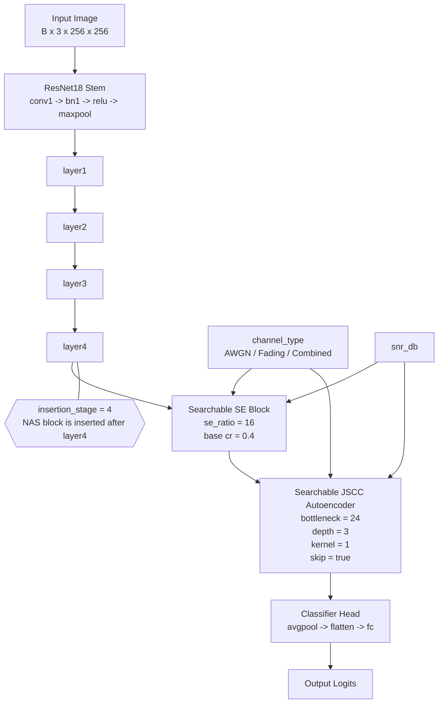

# NAS v2 Top-1 Architecture

下面这张图对应当前 v2 exhaustive search 的 Top-1 架构：

- `insertion_stage = 4`
- `se_ratio = 16`
- `cr = 0.4`
- `bottleneck_channels = 24`
- `ae_depth = 3`
- `kernel_size = 1`
- `use_skip = true`

## 结构说明

- `insertion_stage = 4`：说明 NAS 模块插在 `layer4` 之后，也就是 backbone 的最后一层特征之后。
- `Searchable SE Block`：先做通道筛选与压缩，`se_ratio=16` 表示它使用 16 这个搜索到的比率。
- `Searchable JSCC Autoencoder`：再把特征送入可搜索自编码器进行信道传输模拟，`depth=3`、`kernel=1`、`bottleneck=24` 是当前最优结构参数。
- `use_skip = true`：表示 JSCC 里启用了残差跳连，帮助保留原始特征并提升训练稳定性。
- `channel_type` 与 `snr_db`：会同时影响 SE 与 JSCC 两个模块，因此这不是一个纯离线 backbone，而是一个信道感知模型。

## 对应代码

- [scripts/nas/searchable_model.py](../../scripts/nas/searchable_model.py)
- [results/runs/nas_search_v2/exhaustive_search/UCMerced_LandUse_20260407_212521/best_arch.json](../../results/runs/nas_search_v2/exhaustive_search/UCMerced_LandUse_20260407_212521/best_arch.json)

