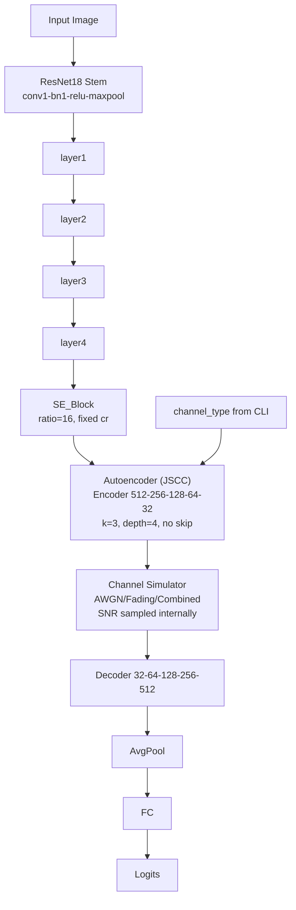
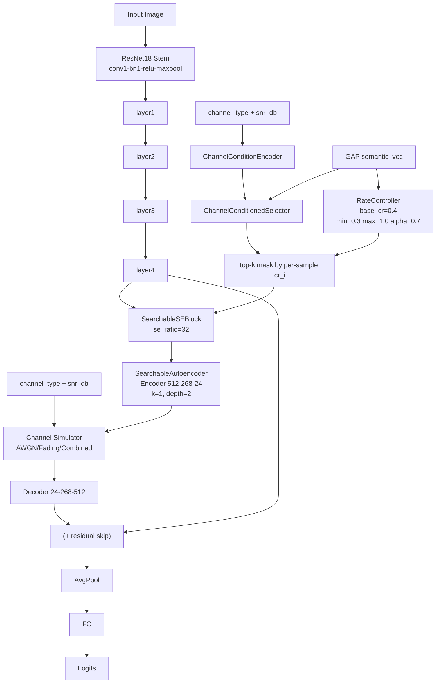

# NAS最优架构 vs 原模型 框架图（对比版）

本图基于以下实际代码与结果：
- 原模型：`scripts/train/ASE-JSCCtrain.py` 中 `SatelliteClassifierWithAttention`
- NAS模型：`scripts/nas/searchable_model.py` 中 `ChannelAwareClassifier`
- 本次最优架构：`runs/nas_search/UCMerced_LandUse_20260305_215121/best_arch.json`
  - `insertion_stage=4`
  - `se_ratio=32`
  - `cr=0.4`
  - `bottleneck_channels=24`
  - `ae_depth=2`
  - `kernel_size=1`
  - `use_skip=true`

## 1) 原模型框架图（Baseline）

## 2) NAS最优架构框架图（Best Arch）

## 3) 核心结构差异（可直接汇报）

| 对比项 | 原模型 | NAS最优架构 |
| --- | --- | --- |
| JSCC插入位置 | 固定在 `layer4` 后 | 本次最优也是 `layer4` 后（但搜索时可选 `3/4`） |
| SE机制 | 普通 SE，固定 `ratio=16`，固定 `cr` | 信道条件化 SE，`ratio=32`，样本级动态 `cr_i` |
| 压缩率 | 全局固定 `cr` | `base_cr=0.4` + `RateController` 动态调节 |
| JSCC结构 | 固定 `depth=4`, `k=3`, `512->...->32` | `depth=2`, `k=1`, `512->268->24` |
| Skip旁路 | 无 | `use_skip=true`（解码输出与输入残差相加） |
| 信道输入方式 | `channel_type` 外部指定，SNR内部随机 | 训练/评估显式传入 `channel_type + snr_db` |

## 4) 一句话总结

原模型是“固定结构 + 固定压缩率”的 ASE-JSCC；NAS 最优架构在保持主干一致的前提下，引入了“信道条件化选择 + 动态样本级 CR + 可搜索 JSCC 轻量结构 + skip”，形成更强的信道自适应能力。
