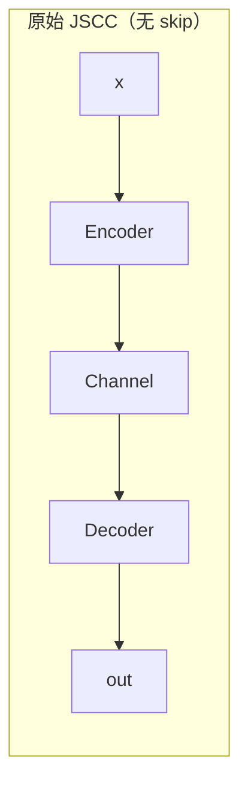
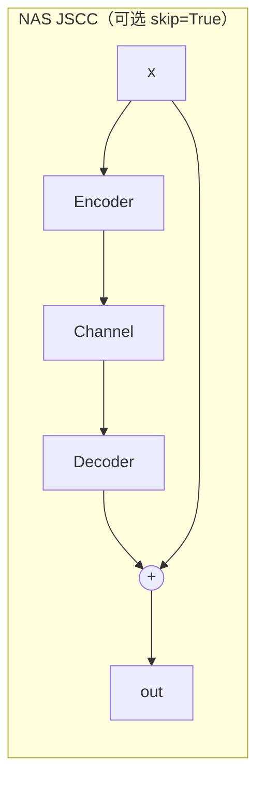

# 原始模型架构与 NAS 搜索对应说明

## 1. 原始 ASE-JSCC 模型架构（基线）

对应代码：`scripts/train/ASE-JSCCtrain.py` 中 `SatelliteClassifierWithAttention`。

原始基线前向流程（固定结构）如下：

```text
输入图像 x (B,3,H,W)
    |
    v
ResNet18 前端
(conv1 -> bn1 -> relu -> maxpool)
    |
    v
layer1 -> layer2 -> layer3 -> layer4
    |                    (输出约 B,512,H/32,W/32)
    v
SE_Block（通道注意力 + 掩码，cr 为固定输入）
    |
    v
Autoencoder(JSCC)
  - Encoder: 512->256->128->64->32
  - 信道扰动: AWGN / Fading / Combined_channel
  - Decoder: 32->64->128->256->512
    |
    v
avgpool -> flatten -> fc(num_classes)
    |
    v
分类输出 logits
```

## 1.1 原始基线逐模块输出形状（以输入 256x256 为例）

记号说明：
- 批大小：`B`
- 类别数：`C_cls`

| 模块 | 输出张量形状 |
|---|---|
| 输入图像 | `(B, 3, 256, 256)` |
| conv1 (ResNet18 默认 7x7, stride=2) | `(B, 64, 128, 128)` |
| bn1 / relu | `(B, 64, 128, 128)` |
| maxpool (3x3, stride=2) | `(B, 64, 64, 64)` |
| layer1 | `(B, 64, 64, 64)` |
| layer2 | `(B, 128, 32, 32)` |
| layer3 | `(B, 256, 16, 16)` |
| layer4 | `(B, 512, 8, 8)` |
| SE_Block 输出（特征乘掩码后） | `(B, 512, 8, 8)` |
| Autoencoder Encoder 第1层 | `(B, 256, 8, 8)` |
| Autoencoder Encoder 第2层 | `(B, 128, 8, 8)` |
| Autoencoder Encoder 第3层 | `(B, 64, 8, 8)` |
| Autoencoder Encoder 第4层（瓶颈） | `(B, 32, 8, 8)` |
| 信道扰动后（AWGN） | `(B, 32, 8, 8)` |
| 信道扰动后（Fading/Combined 内部展平） | `flatten -> (B, 2048)`，再还原为 `(B, 32, 8, 8)` |
| Autoencoder Decoder 第1层 | `(B, 64, 8, 8)` |
| Autoencoder Decoder 第2层 | `(B, 128, 8, 8)` |
| Autoencoder Decoder 第3层 | `(B, 256, 8, 8)` |
| Autoencoder Decoder 第4层 | `(B, 512, 8, 8)` |
| avgpool | `(B, 512, 1, 1)` |
| flatten | `(B, 512)` |
| fc | `(B, C_cls)` |

SE_Block 内部张量形状（原始基线）：
- GAP：`(B, 512, 1, 1)` -> reshape 为 `(B, 512)`
- FC 权重向量：`(B, 512)`
- Mask：`(B, 512, 1, 1)`

## 1.2 NAS 版本插入位置不同的形状差异

在 `scripts/nas/searchable_model.py` 中，`insertion_stage` 有两条路径：

1. `insertion_stage = 3`
- JSCC 输入在 layer3 后：`(B, 256, 16, 16)`
- JSCC 输出仍为：`(B, 256, 16, 16)`（自编码器输入输出同形状）
- 然后继续过 layer4：输出 `(B, 512, 8, 8)` -> `avgpool` -> `fc`

2. `insertion_stage = 4`
- 先过 layer4 得到：`(B, 512, 8, 8)`
- JSCC 在该处处理，输出仍为：`(B, 512, 8, 8)`
- 再 `avgpool` -> `fc`

关键点：
- JSCC 插入位置在原始基线中是固定的：`layer4` 之后。
- SE 的结构固定（ratio=16）。
- AE 结构固定（深度 4、卷积核 3、无显式可选 skip 开关）。
- 训练时 CR 是一个全局输入值（不是样本级动态）。

---

## 2. 我们现在的 NAS 搜索“懂了原模型的哪些地方”

这里的“懂了”指：把原始模型中的哪些固定设计，参数化成可搜索维度。

### 2.1 已被 NAS 参数化并搜索的部分

1. JSCC 插入位置（原来固定）
- 原始：固定在 `layer4` 后
- NAS：`insertion_stage ∈ {3,4}`
- 含义：比较“layer3 后插入”与“layer4 后插入”

2. SE 模块容量
- 原始：`se_ratio=16` 固定
- NAS：`se_ratio ∈ {4,8,16,32}`

3. 压缩率基准 CR
- 原始：单一固定 CR
- NAS：`cr ∈ {0.4,0.6,0.8,1.0}`

4. JSCC 瓶颈宽度
- 原始：最窄通道固定为 32
- NAS：`bottleneck_channels ∈ {16,24,32,48,64}`

5. JSCC 深度
- 原始：编码/解码层数固定
- NAS：`ae_depth ∈ {2,3,4}`

6. 卷积核大小
- 原始：固定 3x3
- NAS：`kernel_size ∈ {1,3,5}`

7. JSCC 残差旁路
- 原始：无 skip 旁路（纯串联的 Encoder->Channel->Decoder）
- NAS：新增可搜索开关 `use_skip ∈ {False,True}`，用于决定是否启用 `out = out + residual`

7.1 加上 skip 后与原始架构的具体区别
- 原始 JSCC（无 skip）：`out = Decoder(Channel(Encoder(x)))`
- 加 skip 的 JSCC：`out = Decoder(Channel(Encoder(x))) + x`（仅在输入输出形状一致时成立）
- 结构层面差异：多了一条“恒等捷径”把 JSCC 输入直接加到输出。
- 训练层面差异：梯度传播路径更短，通常更容易训练稳定，尤其在信道噪声较大时。
- 表征层面差异：模型既可保留原始语义特征，也可学习“补偿项”来修复信道失真。
- 风险与代价：如果 JSCC 本身已学习到较优映射，skip 过强可能削弱压缩-重建模块作用，因此需要作为可搜索开关而不是固定开启。

图示（Mermaid）：





纯文本示意（不依赖 Mermaid 渲染）：

```text
无 skip:
x ──> Encoder ──> Channel ──> Decoder ──> out

有 skip:
           ┌──────────────────────────────────┐
x ──> Encoder ──> Channel ──> Decoder ──> (+) ──> out
 \__________________________________________/
                identity / residual
```

---

### 2.2 在 NAS 版本中新增的“增强理解”

除直接搜索原始结构外，当前可搜索模型还加入了两项原始基线没有的机制：

1. 信道条件化选择（Channel-conditioned selector）
- 选择权重不仅看语义特征，还看 `channel_type + snr`。

1.1 信道条件化选择的具体实现（可汇报版）
- 对输入特征图 `x ∈ R^(B,C,H,W)` 先做全局平均池化（GAP），得到语义向量：`semantic_vec ∈ R^(B,C)`。
- 将当前信道状态编码成条件向量 `cond_vec ∈ R^(B,32)`，分两路：
  - `channel_type`（AWGN/Fading/Combined）先映射为索引，再过 `Embedding` 得到离散信道向量；
  - `snr_db` 归一化后过一个小 MLP 得到连续信道质量向量；
  - 两路拼接成 `cond_vec`。
- 通道权重预测不是只用 `semantic_vec`，而是做“语义分支 + 信道分支”的融合：
  - `fused = W_s * semantic_vec + W_c * cond_vec`
  - `weights = Sigmoid(W_o * ReLU(fused))`，输出 `weights ∈ R^(B,C)`。
- 根据样本级压缩率 `cr_i` 做 Top-k 硬掩码：
  - `k_i = round(cr_i * C)`，保留该样本权重最大的 `k_i` 个通道；
  - 得到 `mask ∈ {0,1}^(B,C)`，再 reshape 成 `(B,C,1,1)`。
- 最终选择结果：`x_selected = x * mask`。

直观理解：
- 传统 SE 只回答“这个语义通道是否重要”；
- 信道条件化 SE 同时回答“在当前信道质量下，这个通道还值不值得发”；
- 所以它本质是在做“语义重要性 + 信道适配性”的联合选择。

2. 动态样本级压缩率（Dynamic per-sample CR）
- 每个样本可预测不同 CR，而不是整批共享一个固定 CR。

2.1 动态样本级压缩率的具体实现（代码级）
- 入口位置：`SearchableSEBlock.forward(...)`（`scripts/nas/searchable_model.py`）。
- 输入来源：
  - `semantic_vec`：由当前特征图做 GAP 得到，形状 `(B, C_se)`；
  - `cond_vec`：由 `channel_type + snr_db` 编码得到，形状 `(B, 32)`。
- `RateController` 计算每样本压缩率的步骤：
  - 拼接输入：`z = concat([semantic_vec, cond_vec], dim=1)`，形状 `(B, C_se+32)`；
  - 经过 MLP（Linear-ReLU-Linear-ReLU-Linear-Sigmoid）得到 `raw ∈ (0,1)`，形状 `(B,)`；
  - 映射到动态范围：`dynamic_cr_i = min_cr + (max_cr - min_cr) * raw_i`；
  - 与架构基准 `base_cr(=arch.cr)` 融合：
    - `cr_i = (1 - alpha) * base_cr + alpha * dynamic_cr_i`
  - 最后裁剪：`cr_i = clamp(cr_i, min_cr, max_cr)`。
- 关闭动态码率时（`--disable_dynamic_rate`）：
  - 不走预测分支，直接令所有样本 `cr_i = base_cr`（整批固定）。
- `cr_i` 如何作用到通道筛选：
  - 每个样本计算 `k_i = round(cr_i * C_se)`，并限制在 `[1, C_se]`；
  - 按 `weights` 做样本级 top-k，得到二值掩码 `mask_i`；
  - `mask_i` reshape 为 `(B, C_se, 1, 1)` 后与特征逐通道相乘。
- 训练/评估统计如何记录：
  - 每个 batch 会记录 `mean_cr / std_cr / min_cr / max_cr` 到 `last_forward_stats`；
  - 搜索阶段的 `mean_cr`、`std_cr` 即由这些 batch 统计聚合得到。

这两点让模型更贴近“信道感知通信”场景。

---

## 3. NAS 与原始模型的关系（一句话汇报版）

可以对老师这样汇报：

> 我们不是从零设计新网络，而是在原始 ASE-JSCC 基线（ResNet18 + SE + JSCC）上，把关键的固定设计点（插入位置、SE 容量、压缩率、AE 结构）做成可搜索参数，并加入信道条件化与动态码率机制，在多目标约束下自动找到更优配置。

---

## 4. 当前尚未纳入搜索的部分（边界说明）

- Backbone 类型与层数（仍是 ResNet18）
- 分类头结构（仍为单层 FC）
- 优化器/损失函数类型（搜索阶段固定）
- 更细粒度每层独立算子（当前是宏观结构搜索）

---

## 5. 常见问答汇总（针对第一版 NAS 试跑）

1. 搜索空间和算子库是什么关系？
- 可以把 `search_space.py` 理解为“可选配置表”，定义每个维度有哪些候选值。
- 真正的“算子实现/模型拼装”在 `searchable_model.py` 里。
- 关系是：`search_space` 负责“选什么”，`searchable_model` 负责“怎么搭起来跑”。

2. `search_space` 里定义的就是搜索空间吗？
- 是。`SearchSpace.default()` 给出的 7 个维度就是当前第一版 NAS 的搜索空间。

3. `searchable_model` 是不是在 `search_space` 基础上把模型架构搭好？
- 是。`ArchitectureConfig`（来自 `search_space.py`）会驱动 `SearchableSatelliteClassifier` 选择插入位置、SE 比例、AE 深度、卷积核、是否 skip 等具体结构。

4. 现在这个搜索空间是不是太简单？
- 从“算子级 NAS”角度看是偏简单的；从“第一版试跑”角度是合理的。
- 目前是宏观结构搜索（2880 组合），优先验证方向与流程可行，再决定是否扩展到更细粒度搜索。

5. JSCC 是哪几个模块？
- 本质是 `Encoder -> Channel -> Decoder`。
- 原始项目是固定串联；NAS 版本新增了可选 `skip`（残差旁路）开关。

6. 为什么有“接在 layer3 / layer4 后”的选择？
- `layer3` 后插入：分辨率更高（`16x16`），语义稍浅，但可能保留更多空间细节。
- `layer4` 后插入：语义更强（`8x8`），特征更紧凑，通信负担通常更低。
- 这是典型“语义深度 vs 空间细节 vs 传输代价”的折中点搜索。

7. 如果接在 layer3 后，layer4 就没有了吗？
- 没有丢掉。`insertion_stage=3` 时流程是：`... -> layer3 -> JSCC -> layer4 -> avgpool -> fc`。

8. JSCC 不是已经解码了吗，为什么后面还能接 layer4（编码层）？
- 这里的“解码”是 JSCC 的特征重建，不是分类网络最终解码。
- 当插在 `layer3` 后时，JSCC 输出仍是中间特征图，当然可以继续送入 `layer4` 做更高层语义提取。
- 当插在 `layer4` 后时，后面就不再经过 `layer4`，直接池化分类。

9. 原本 JSCC 深度是不是 4？
- 是。原始 `Autoencoder` 为 4 层编码卷积 + 4 层解码反卷积（通道 512->256->128->64->32，再反向恢复）。

10. 原本 JSCC 有 skip 吗？加 skip 与原始区别是什么？
- 原始没有 skip，就是纯串联：`Decoder(Channel(Encoder(x)))`。
- NAS 新增可选 skip 后是：`Decoder(Channel(Encoder(x))) + x`。
- 作用是增强梯度传递和噪声场景稳定性，但也可能削弱“强压缩重建”的约束，所以设为可搜索开关而不是固定开启。

11. 原本项目里的“信道鲁棒”逻辑是什么？改进在哪？
- 原始：主要靠信道仿真训练（AWGN/Fading/Combined）+ 随机 SNR 扰动提升鲁棒性；SE 只看语义，不看显式信道状态。
- 改进：NAS 版本把 `channel_type + snr` 显式编码成条件向量，参与通道选择和动态码率预测，实现“按当前信道自适应”。

12. 原本训练是否可以理解为实际就一个 Combined 信道？
- 训练脚本默认参数确实是 `Combined_channel`（命令行默认值）。
- 但代码也支持手动指定 `AWGN` 或 `Fading`，一次实验通常是固定一种 `channel_type`。

13. “当前信道状态编码成条件向量”具体是什么意思？
- 把离散信道类型（AWGN/Fading/Combined）做 embedding；
- 把连续 `snr_db`（归一化后）送入小 MLP；
- 两路向量拼接成 `cond_vec`，再和语义向量一起用于通道权重与码率预测。

14. GAP 是什么？
- GAP 是 Global Average Pooling（全局平均池化），这里用 `AdaptiveAvgPool2d(1,1)` 把 `(B,C,H,W)` 压成 `(B,C,1,1)`，再展平成 `(B,C)`。

15. `snr_db` 本身是数字，为什么还要归一化？
- 数值稳定性考虑。把输入尺度约束到近似 `[0,1]`，更利于 MLP 训练，避免与其他分支特征尺度差异过大。

16. MLP 是什么？
- MLP 是 Multi-Layer Perceptron（多层感知机），就是若干全连接层 + 非线性激活组成的小网络。

补充代码定位（便于快速对照）：
- 原始基线主干：`scripts/train/ASE-JSCCtrain.py`
- 搜索空间定义：`scripts/nas/search_space.py`
- 可搜索模型与信道条件化实现：`scripts/nas/searchable_model.py`

---

## 6. 本轮补充问答（语义分支与动态压缩率）

1. “语义特征分支”从哪个模块来？
- 来自当前插入位置的 backbone 特征图 `x`，先做 GAP 得到 `semantic_vec`。
- `insertion_stage=3` 时，`x` 来自 `layer3` 输出；
- `insertion_stage=4` 时，`x` 来自 `layer4` 输出。
- 因此语义分支不是额外网络输出，而是“当前语义特征的全局统计”。

2. `weights = Sigmoid(W_o * ReLU(fused))` 的 `weights`，是不是 SE 里和通道相乘的权重？
- 本质上是同一类“通道重要性权重”（每通道一个分数）。
- 但当前实现不是直接 `x * weights`，而是先按 `CR` 做 top-k，得到二值 `mask`，最后 `x * mask`。
- 即：`weights -> mask -> 作用到通道`。

3. 动态样本级压缩率（Dynamic per-sample CR）怎么实现？
- 输入特征做 GAP 得 `semantic_vec`，信道状态编码得 `cond_vec`。
- `RateController` 以 `[semantic_vec, cond_vec]` 为输入，输出每个样本的 `raw_i in (0,1)`。
- 再映射到 `[min_cr, max_cr]`，并与 `base_cr` 线性融合，得到每个样本的 `CR_i`。
- 按样本计算 `k_i = round(CR_i * C)`，做 top-k 通道保留，形成样本级掩码。

4. 这样做的好处是什么？
- 资源分配更精细：困难样本/差链路可分更多通道，简单样本/好链路可更强压缩。
- 在相同平均通信预算下，通常能提升整体任务精度。
- 对信道波动更稳健，避免固定 `CR` 一刀切造成的性能浪费或信息损失。
- 更符合真实通信场景中的“按状态自适应传输”逻辑。
